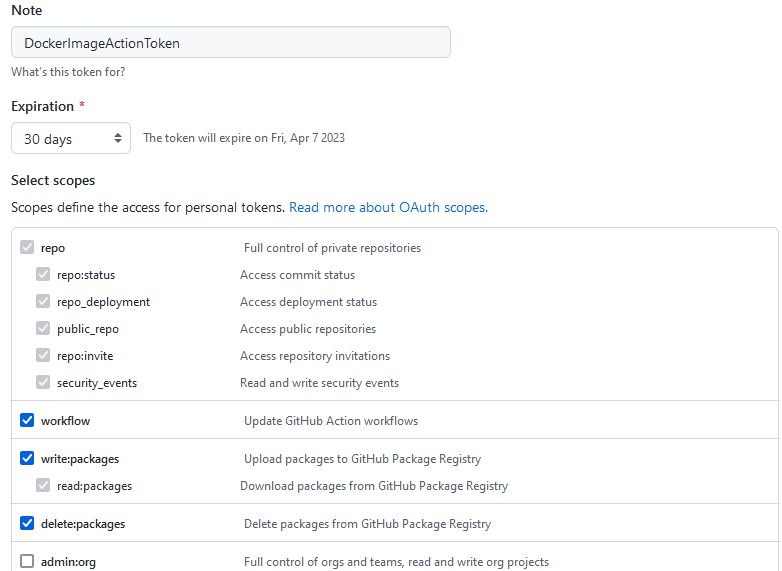

# TP2 Qualité de code et CI/CD
Lors de la réalisation d'un projet, il est important de pouvoir maintenir un code de bonne qualité et de faire en sorte que chacune de vos contributions soit la plus propre possible.
C'est dans cette optique que les outils de Continous Integration (CI) et de Continous Delivery/Deployment (CD) ont été créés.
Ensemble, ils forment ce qu'on appelle la CI/CD, un set d'outils pour automatiquement tester, builder et déployer vos projets (entre autres).

Dans ce TP, nous allons découvrir et utiliser les outils suivants:
- Les GitHub Actions (outils de CI/CD)
- SonarCloud (Qualité de code)
- GitLab CI/CD

## Structure du dossier TP2
    ├── README.md
    ├── src                                     <- Application à tester
    │   |
    │   └── __init__.py
    |   └── wallet.py                           <- Module gestion d'un porte-monnaie
    │
    ├── controller
    │   └── __init__.py
    │   └── controller.py                       <- Module de webapp
    │
    ├── tests
    │   └── fixtures
    │   |   └── __init__.py
    │   │   └── wallet_fixtures.py
    │   |
    │   └── unit
    │       └── __init__.py
    │       └── test_wallet.py                  <- Tests unitaires pour la librairies wallet.py
    │
    ├── .coveragerc                             <- Fichier de configuration du coverage
    ├── .gitignore
    ├── .pre-commit-config.yaml                 <- Fichier de configuration de pre-commit
    ├── .gitlab-ci.yml                          <- Fichier de configuration de Gitlab CI/CD
    ├── Dockerfile                              <- Fichier de creation d'image Docker
    ├── setup.py                                <- Fichier setup. Permet de packager un projet python
    ├── test_wheel.py
    └── requirements.txt

## Exercice 1: GitHub Actions
Le but de cet exercice est de vous faire découvrir les outils CI/CD de GitHub.
Si vous n'en avez pas déjà un, créez un compte sur [le site de GitHub](https://github.com/).
Si besoin, faites les configurations nécessaires (par exemple créer une paire de clés SSH pour pouvoir copier le repo).

### a)
Une fois connecté sur GitHub, créez un nouveau repository, donnez-lui un nom et laissez les autres paramètres par défaut.
Veillez à ce que le repository soit bien public et non privé. Dans le cas contraire, vous serez bloqué pour l'exercice 2.

Copiez ensuite le contenu du dossier `TP2` dans le nouveau repo en suivant ces étapes:
- Clonez votre nouveau repo
- Copiez le contenu du dossier TP2 dans le repository
- Mettez à jour votre repository avec les commandes usuelles de git

**NOTE:** Certains éléments comme le dossier `.git` (normalement invisible) ou votre dossier d'envionnement python `venv` ne sont bien sûr pas à copier.

Arrivé à cette étape, vous devriez posséder un repository GitHub dont le contenu est une copie exacte de ce TP.

### b)
Vous allez créer maintenant votre première action. Rendez-vous sur la page de votre projet GitHub et cliquez sur le menu `Actions`.
GitHub vous propose diverses actions prédéfinies, choisissez `Python application` et cliquez sur `Configure`.
Si cette action ne vous est pas directement proposée, vous pouvez utiliser la barre de recherche pour la trouver.


GitHub s'occupe de créer le fichier `python-app.yml` et de le remplir.
Analysez son contenu et répondez aux questions.

**Quelles étapes sont réalisées par cette action ?**
**Réponse:** <Entrez_votre_réponse>

**Une étape est définie au minimum par 2 paramètres, lesquels sont-ils et à quoi servent-ils ?**
**Réponse:** <Entrez_votre_réponse>

**La première étape contient un paramètre 'with', a quoi sert-il ?**
**Réponse:** <Entrez_votre_réponse>

Vous pouvez maintenant cliquer sur `Start Commit` et `Commit new file` pour créer un nouveau commit et pousser votre nouvelle action dans le repo.
En retournant dans le menu `Actions`, vous pouvez maintenant voir que le push a déclenché votre action et qu'elle est en train de s'exécuter.
Utilisez la commande `git pull` sur votre repo local et constatez qu'un nouveau fichier `python-app.yml` s'est créé dans le dossier `.github\workflows`.
C'est dans ce dossier que vous trouverez tous les fichiers de configuration de vos actions.

### c)
Vous allez maintenant modifier le fichier `python-app.yml` pour créer une action un peu plus complexe. Actuellement, votre fichier ne contient qu'un seul job nommé *build*.
Un job, dans le cadre des Actions GitHub, est une série d'étapes effectuées par le même runner. Il est possible d'en avoir plusieurs par action et c'est ce que nous allons faire ici.

Ajoutez le morceau de code suivant à la fin du fichier:

```yaml
  docker-image:

    runs-on: ubuntu-latest

    steps:
    - uses: actions/checkout@v3
    - name: Login to registry
      run: echo ${{ secrets.PERSONAL_TOKEN }} | docker login ghcr.io -u <username> --password-stdin
    - name: Build the Docker image
      run: docker build . --file Dockerfile --tag ghcr.io/<username>/tp2:latest
    - name: Push the image into the registry
      run: docker push ghcr.io/<username>/tp2:latest
```

Il s'agit d'un nouveau job qui va s'occuper de créer une image Docker du projet et de la pousser sur le container registry de votre compte GitHub.
Faites attention à l'indentation, `docker-image` doit être au même niveau que `build`.

Avant de pousser vos modifications sur le repository, 2 choses sont à faire:
- Le code ci-dessus contient des balises `<username>`. Remplacez-les par votre nom d'utilisateur GitHub.
- Créez un personal token. Ce dernier permet au runner qui exécutera l'action d'avoir les droits d'accès à votre container registry.

Pour ce deuxième point, il suffit de vous rendre dans les paramètres de votre compte GitHub sous `Settings > Developer settings > Personal access tokens`.
Cliquez sur "Tokens (classic)" puis sur "Generate new token (classic)". Donner lui une description et les droits d'accès aux packages, comme montré ci-dessous:



Cliquez ensuite sur `Generate token` en bas de la page. Copiez le token généré et notez le quelque part, vous ne pourrez plus y avoir accès une fois la page quittée.
Rendez-vous ensuite sur la page de votre repository et allez sous `Settings > Secrets and variables > Actions`.
Créez un nouveau secret en cliquant sur `New repository secret`. Nommez le "PERSONAL_TOKEN" et entrez votre token comme valeur.

Une fois cela fait, tout devrait marcher. Vous pouvez maintenant pousser vos modifications sur le repository et observer votre action s'exécuter.

## Exercice 2: Qualité de code
Dans le TP1 nous avions vu l'outil *pre-commit* qui permet d'appliquer, entre autres, des règles de formatage à votre code avant de le pousser sur le repo.

Ici nous allons plus loin grâce à l'outil SonarQube. Ce dernier permet, en le combinant avec la CI/CD, d'analyser votre code en profondeur une fois un push réalisé.
Ainsi, vous pouvez rapidement voir si votre code contient des problèmes de maintenabilité, sécurité, etc.

SonarQube existe aussi en version [SaaS](https://fr.wikipedia.org/wiki/Software_as_a_service), à savoir SonarCloud, qui offre les mêmes capacités sans devoir se soucier de la gestion du serveur. C'est cette version que nous allons utiliser dans ce TP.

### a)
Pour commencer, il faut lier votre compte GitHub à SonarCloud. Pour ce faire, allez sur [la page de connexion de SonarCloud](https://sonarcloud.io/login) et choisissez la connexion via GitHub.
SonarCloud va vous guider pour lier votre compte et choisir un repo à analyser. Sélectionnez le repo que vous avez créé pour l'exercice 1.
Le processus devrait être facile et en quelques minutes vous pourrez voir la 1ère analyse du projet.

Une analyse de code va maintenant se lancer à chaque push et vous pourrez voir les résultats depuis le tableau de bord de SonarCloud.
Après la 1ère analyse, peu d'informations sont montrées. C'est parce que certaines fonctionnalités, comme le *Quality Gate* de SonarCloud, comparent l'évolution des push. Il vous faut donc au minimum deux push pour les voir apparaître.

Dans les sources du projet, modifiez `wallet.py` en lui rajoutant une méthode `get_balance(self)` qui retourne l'attribut balance de la classe. Poussez à nouveau vos changements sur le repository.

Lors de cette deuxième analyse, vous devriez voir des nouveaux indicateurs dans l'onglet "Overview" de SonarCloud.

**Sur l'onglet `Summary` d'une analyse de code, SonarCloud fournit 4 indicateurs. Quels sont-ils et quels sont leurs utilités ?**

**Réponse:** <Entrez_votre_réponse>

**A quoi sert l'indicateur Quality Gate ?**

**Réponse:** <Entrez_votre_réponse>

### b)
Par défaut, SonarCloud s'occupe de faire la connexion avec votre projet GitHub automatiquement.
C'est certes très pratique mais cette méthode ne permet pas de personnaliser la configuration, ce qui nous prive de certaines fonctionnalités.
Vous allez donc modifier la méthode de connexion entre GitHub et SonarCloud en y ajoutant l'analyse du coverage.

Depuis le tableau de bord du projet sur SonarCloud, rendez-vous sur `Administration > Analysis Method`.
Décochez "Automatic Analysis" et suivez le tutorial "GitHub Actions". Ce dernier vous propose une étape "Create or update a build file" pour créer une nouvelle action. Vous pouvez ignorer cette étape. A la place, vous allez simplement modifier le fichier `python-app.yml` qui existe déjà dans le répertoire de votre projet.
Modifiez le job *build* comme suit (les modifications sont commentées pour mieux vous rendre compte des changements):

```yaml
build:

    runs-on: ubuntu-latest

    steps:
    - uses: actions/checkout@v3
    - name: Set up Python 3.10
      uses: actions/setup-python@v3
      with:
        python-version: "3.10"
        fetch-depth: 0 # fetch all history for all branches and tags
    - name: Install dependencies
      run: |
        python -m pip install --upgrade pip
        pip install flake8 pytest
        if [ -f requirements.txt ]; then pip install -r requirements.txt; fi
    - name: Lint with flake8
      run: |
        # stop the build if there are Python syntax errors or undefined names
        flake8 . --count --select=E9,F63,F7,F82 --show-source --statistics
        # exit-zero treats all errors as warnings. The GitHub editor is 127 chars wide
        flake8 . --count --exit-zero --max-complexity=10 --max-line-length=127 --statistics
    - name: Test with pytest # Using --cov=. --cov-report=xml to create a coverage and export it as an xml file
      run: |
        pytest --cov=. --cov-report=xml
    - name: SonarCloud Scan # Add a SonarCloud Scan step to make the connection with SonarCloud
      uses: SonarSource/sonarcloud-github-action@master
      env:
        GITHUB_TOKEN: ${{ secrets.GITHUB_TOKEN }}
        SONAR_TOKEN: ${{ secrets.SONAR_TOKEN }}
```

Pour finir, il vous reste encore à indiquer à SonarCloud où trouver le fichier de coverage.
Pour cela, il suffit d'ajouter les lignes suivantes au fichier `sonar-project.properties`:

```
sonar.python.coverage.reportPaths=coverage.xml
sonar.coverage.exclusions=**/tests/**,**/controller/**,setup.py
```

Notez que la deuxième ligne indique à SonarCloud d'ignorer certains dossiers/fichiers pour le calcul du coverage. Sans cela, tous les fichiers Python sont considérés.

Une fois terminé, vous pouvez pousser les modifications sur le repository. L'action GitHub va se lancer, et l'analyse SonarCloud commencera. Vous devriez maintenant avoir accès au coverage. Allez sur l'onglet `Summary` du projet SonarCloud, cliquez sur le bouton `Overall Code` et répondez aux questions suivantes.

**Quelle est la différence entre les sections `New code` et `Overall Code` dans l'onglet Summary ?**

**Réponse:** <Entrez_votre_réponse>

**Y a-t-il des Code Smells ? Si oui, combien et pour quelle(s) raisons(s) ?**

**Réponse:** <Entrez_votre_réponse>

**Y a-t-il des Security Hotspots ? Si oui, combien et pour quelle(s) raison(s) ?**

**Réponse:** <Entrez_votre_réponse>

### c)

Maintenant que vous savez quelles erreurs se sont glissées dans le code, modifiez le pour enlever les Code Smells et Security Hotspots.
SonarCloud est assez intelligent pour comprendre les erreurs et vous proposer des solutions. Pour voir son fonctionnement, consultez les sections du tableau de bord.
Ensuite, poussez vos modifications sur le repository. L'analyse de code ne devrait plus indiquer d'erreur.

## Exercice 3: Gitlab CI/CD

Pour finir, vous allez utilisez le fichier `.gitlab-ci.yml` proposé à la racine de ce projet.
Tout comme GitHub, Gitlab offre la possibilité des outils de CI/CD configurables à partir de fichiers yaml.
Un fichier définit une [Pipeline](https://docs.gitlab.com/ee/ci/pipelines/) et cette dernière contient un ou plusieurs jobs.

### a)

Rendez-vous sur [la forge étudiante Gitlab](https://gitlab-etu.ing.he-arc.ch/) et créez un nouveau repository. De la même manière qu'à l'exercice 1, copiez le contenu du dossier TP2 dans votre nouveau repo. Une fois vos modifications poussées, la pipeline devrait se lancer et être visible depuis l'onglet `CI/CD > Pipelines` du projet Gitlab.
Analysez le contenu du fichier `.gitlab-ci.yml` et ainsi que le comportement de la Pipeline puis répondez ensuite aux questions.

**1. Que fait le job pytest ?**

**Réponse:** <Entrez_votre_réponse>

**2. Que fait le job image-creation ?**

**Réponse:** <Entrez_votre_réponse>

**3. Que fait le job package-creation ?**

**Réponse:** <Entrez_votre_réponse>

**4. Les jobs s'exécutent-ils dans le même ordre que définit dans le fichier ? Sinon, pourquoi ?**

*Indice: Demandez-vous comment on définit l'ordre d'exécution des jobs en Gitlab CI/CD.*

**Réponse:** <Entrez_votre_réponse>

**5. Le stage 2 génère une image Docker. Où est-elle stockée et comment pouvez-vous la retrouver ?**

**Réponse:** <Entrez_votre_réponse>

**6. Le stage 3 génère un wheel Python. Où est-il stocké et comment pouvez-vous le retrouver ?**

**Réponse:** <Entrez_votre_réponse>

### b)
En partant de votre réponse à la dernière question, installez le wheel sur votre machine et testez que le package ce soit bien installé.
Pour vous aider, lancez le fichier `test_wheel.py` avec la commande `python`. Ce fichier s'occupe d'importer le package et de créer un wallet. Si le package est correctement installé, vous devriez voir le message suivant.

```bash
Congratulation. you successfuly installed TP2 package !
```

## Déliverables
Au terme de ce TP, vous devez rendre:
- Le dossier TP2 avec vos réponses aux questions dans le fichier `README.md`
- Le lien de votre repository GitHub
- Le lien de votre repository Gitlab sur la forge étudiante

**Lien du repository GitHub:** <Entrez_votre_réponse>

**Lien du repository Gitlab:** <Entrez_votre_réponse>
